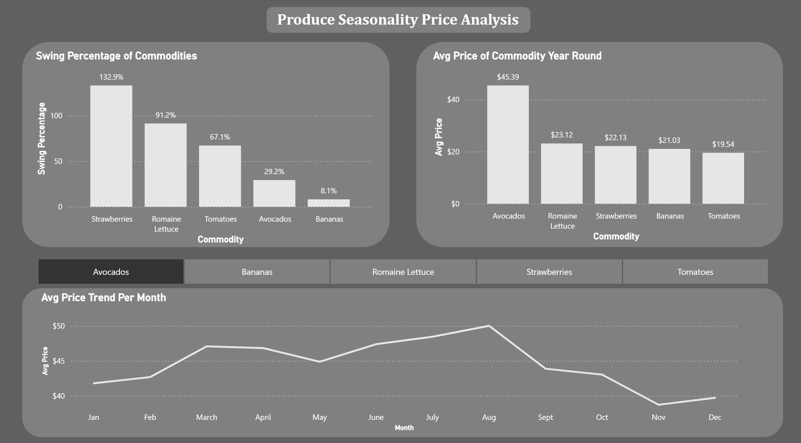
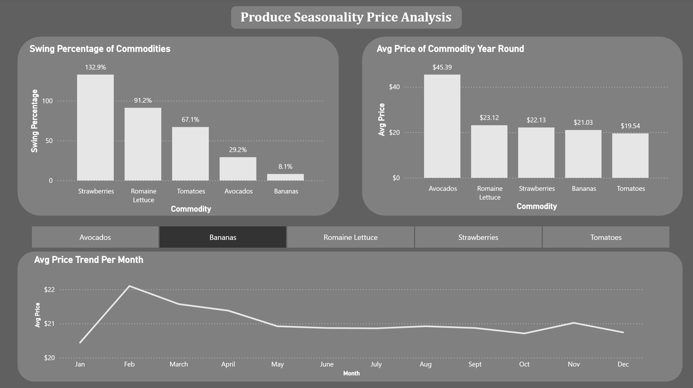
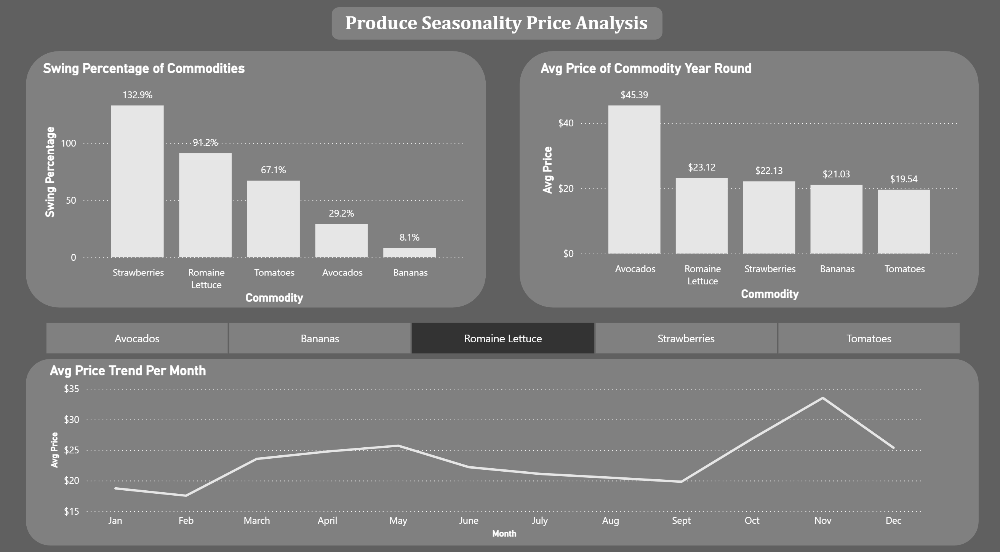
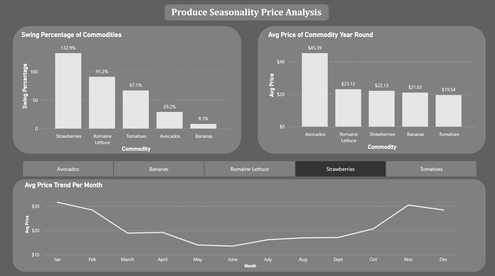
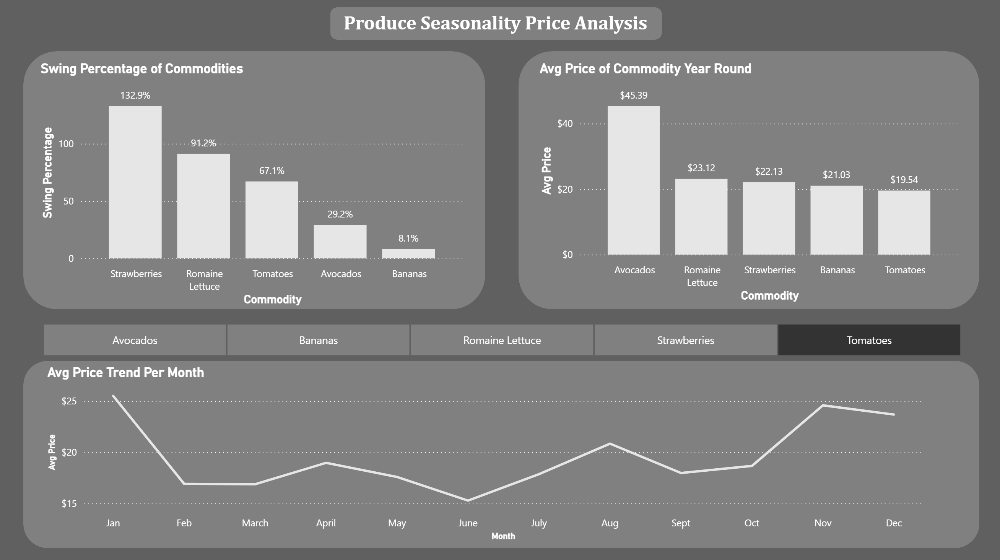

# Produce Seasonality Price & Cash Flow Planning Analysis

## Business Question
How do wholesale prices for Avocados, Tomatoes, Romaine Lettuce, Strawberries, and Bananas change seasonally, and what does that mean for how a produce company should plan cash flow around purchasing throughout the year?

Note:

This analysis identifies general seasonal pricing patterns (when prices tend to rise or fall) for each commodity, rather than precise, unit-normalized price points. Because prices are averaged across varying 
package sizes, the direction and approximate timing of seasonal swings are reliable, but exact percentage magnitudes should be treated as directional estimates rather than precise figures.

## Data Source
- USDA AMS Specialty Crops Market News — Terminal Market daily price reports
- [My Market News public data tool](https://mymarketnews.ams.usda.gov/public_data)
- Market hub: Los Angeles, California 
- Jan 2023 – Dec 2025, daily granularity, pulled per commodity in 12-month increments (this was the tool query limit)

## Cleaning (pandas)
- Dropped 15 columns that were empty or populated in under 15% of rows
- Filtered to conventional (non-organic) listings to avoid price-premium skew
- Built a representative price per listing: USDA's "mostly price" when available, falling back to the low/high midpoint (~45% of rows) when missing
- Dropped 145 rows with no usable price, and 14 rows with a generic "Imports" origin label

## Database Schema (PostgreSQL)
Normalized, 3-table design:
- `commodities`: commodity_id, commodity_name
- `origins`: origin_id, origin, ... Did not end up using this table in my analysis
- `daily_prices`: commodity_id, report_date, origin_id, avg_price, min_price, max_price, num_listings

Loaded via a staging table to translate raw text values into proper foreign key IDs before inserting into the final fact table.

## Key Findings

**Overall average price (2023–2025, LA terminal market):**
Avocados were the most expensive commodity on average (~$45/unit), followed by Romaine Lettuce (~$23), Strawberries (~$22), Bananas (~$21), and Tomatoes (~$20, the least expensive).

**Seasonal price swings (cheapest month vs. most expensive month):**

| Commodity | Cheapest Month | Most Expensive Month | % Swing |
|---|---|---|---|
| Strawberries | June ($13.57) | January ($31.60) | ~133% |
| Romaine Lettuce | February ($17.53) | November ($33.52) | ~91% |
| Tomatoes | June ($15.27) | January ($25.51) | ~67% |
| Avocados | November ($38.72) | August ($50.03) | ~29% |
| Bananas | January ($20.44) | February ($22.10) | ~8% |

**What this means for cash flow planning:**
- **Strawberries and Romaine Lettuce carry the highest seasonal price risk**. A produce company should plan for significantly higher cash outlay during their respective peak months (January for strawberries, November for lettuce), and can plan to stock up more heavily during their low-price months.
- **Bananas are the most stable and predictable** commodity to budget for year-round, since they're imported continuously from multiple countries with no single dominant growing season driving scarcity.
- **Avocados and Tomatoes fall in the middle**. moderate seasonal swings worth planning around, but less extreme than strawberries or lettuce.

## Dashboard (Power BI)
- Bar chart: overall average price by commodity
- Line chart with commodity slicer: monthly price trend, 2023–2025 combined
- Bar chart: seasonal price swing (%) by commodity

## Limitations
- This analysis identifies general seasonal pricing patterns (when prices tend to rise or fall) rather than precise, unit-normalized price points. Prices are averaged across all reported package sizes and units for each commodity; this mix is fairly consistent for Strawberries and Bananas (one package type dominates), but more fragmented for Tomatoes (7 package types, 19 size codes). As a result, the direction and approximate timing of seasonal swings are reliable, but exact percentage magnitudes should be treated as directional estimates rather than precise figures.
- Terminal Market data reflects Los Angeles wholesale pricing.
- These are public wholesale benchmark prices, not the actual contract prices large distributors negotiate directly with growers. Although benchmark prices reflect the same underlying seasonal supply/demand patterns relevant to purchase timing decisions.

## Dashboard Screenshots

The dashboard includes a commodity slicer that lets you view the monthly 
price trend for each item individually. Examples below:

- Bar chart: overall average price by commodity
- Line chart with commodity slicer: monthly price trend, 2023–2025 combined
- Bar chart + dynamic card: seasonal price swing (%) by commodity

## Tools
Python (pandas), PostgreSQL, SQL, GitHub

